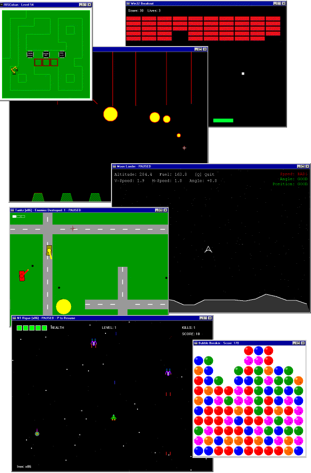

# NT Games

Remakes of some classic games for NTOS. Aimed mostly at NT RISC architectures. With source code and binaries for all platforms. Alpha, AXP64, ARM, AARCH64, MIPS, PowerPC, Itanium, etc.

PRs with fixes, features and new games welcome!

## RISC building instructions

### ARM

Only available in MSVC (2022), `C:\Program Files\Microsoft Visual Studio\2022\Community\VC\Auxiliary\Build\vcvarsamd64_armXXX.bat`.

### IA64

Win7 SDK only (not Visual Studio), use `setenv /ia64 /2008 /release`

For security cookie complain add `/GS-` flag.

Also 2003 is problematic use Win7 SDK only.

### AXP64

Microsoft Platform SDK for Windows 2000 RC2, aka psdk99, `setwin64.bat`, use `cl.exe -D_AXP64_=1 -D_ALPHA64_=1 -DALPHA=1 -DWIN64 -D_WIN64 -DWIN32 -D_WIN32  -Wp64 -W4 -Ap64`

## License
All code is public domain.
