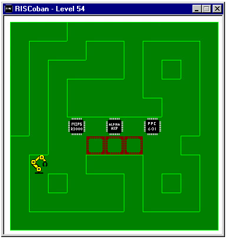

# RISCoban for Windows NT

- The code is Public Domain
- Levels generated by https://github.com/mezpusz/sokohard

## Theme
This is a RISC processor themed Sokoban game. You control a robot arm that needs to place
different processor chips (MIPS, Alpha AXP, PowerPC, and ARM) into their matching sockets.

## Keys

- R - restart
- Pg Up - next level
- Pg Dn - prev level
- Alt F4 - exit

## Building

- make levels
- make
