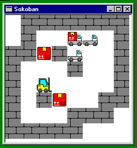

# Sokoban for Windows NT

- The code is Public Domain
- Sprites stolen from https://www.freepik.com
- Levels generated by https://github.com/mezpusz/sokohard

## Running

You need a binary matching your platform and the `levels/*.sok`.

## Keys

- R - restart
- Pg Up - next level
- Pg Dn - prev level
- Alt F4 - exit

## Levels

You can generate your own levels using https://github.com/mezpusz/sokohard
